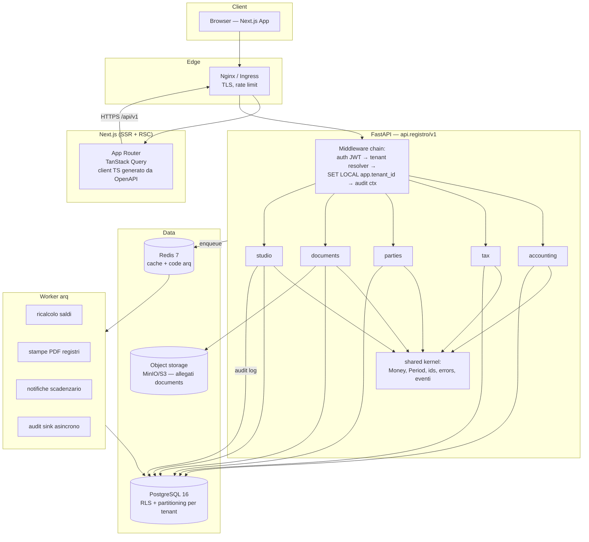

# Registro Contabilità — Architettura di Sistema

> Documento di architettura v1.0 — 2026-07-02
> Sistema ERP contabile multi-tenant per studio di commercialisti italiano.

---

## 1. Stack tecnologico e motivazione

### 1.1 Backend: FastAPI (Python 3.12+) vs NestJS

| Criterio | FastAPI | NestJS | Valutazione |
|---|---|---|---|
| Tipizzazione dominio | Pydantic v2: validazione dichiarativa, `Decimal` nativo | class-validator + DTO; `Decimal` richiede lib esterne (decimal.js) e attenzione alla serializzazione | **FastAPI**: gli importi contabili DEVONO essere `Decimal`, mai float. Python ha `decimal.Decimal` nello standard library con contesto di arrotondamento controllabile (ROUND_HALF_UP, richiesto per IVA) |
| Ecosistema fiscale/contabile | Librerie mature: `python-dateutil` (competenza/scadenze), `codicefiscale`, generazione XML FatturaPA (`lxml`), parsing tracciati | Ecosistema JS più orientato al web | **FastAPI** |
| ORM + migrazioni | SQLAlchemy 2.0 + Alembic: supporto first-class a RLS, partitioning, CHECK constraints, `session_variables` per tenant context | TypeORM/Prisma: Prisma non supporta bene RLS e partitioning dichiarativo | **FastAPI**: il multi-tenancy via RLS (vedi §5.1) è il vincolo decisivo |
| Async / performance | ASGI (uvicorn), async nativo; per un gestionale di studio (decine di utenti concorrenti) più che sufficiente | Performance simili su Fastify adapter | Pari |
| DI e modularità | Meno "framework-driven": si usa struttura a package per bounded context + `Depends()` | DI container eccellente, moduli espliciti | **NestJS** vince sul framework, ma la disciplina a package (§4) compensa |
| OpenAPI | Generata automaticamente da Pydantic, usata per generare il client TS del frontend | Decoratori Swagger manuali | **FastAPI** |
| Team singolo full-stack | Python + TS: due linguaggi | Tutto TS | **NestJS** vincerebbe se il calcolo fiscale non pesasse così tanto |

**Scelta: FastAPI.** Fattori decisivi: (a) `Decimal` e aritmetica di arrotondamento fiscale affidabile out-of-the-box; (b) SQLAlchemy/Alembic per RLS e partitioning PostgreSQL; (c) OpenAPI → client TypeScript generato colma il gap del doppio linguaggio.

### 1.2 Frontend: Next.js vs alternative

| Criterio | Next.js 14+ (App Router) | Remix | SPA pura (Vite+React) | SvelteKit |
|---|---|---|---|---|
| Tabelle dati pesanti (prima nota, mastrini) | RSC per primo render + TanStack Table client-side | Buono | Buono ma TTI peggiore su dataset grandi | Buono |
| Ecosistema componenti (griglie editabili, date picker fiscali) | Massimo (React) | Massimo (React) | Massimo | Ridotto |
| Auth/session server-side | Middleware + route handlers | Ottimo | Richiede BFF separato | Buono |
| Stabilità a lungo termine per gestionale interno | Alta, mainstream | Alta ma ecosistema più piccolo | Alta | Media |

**Scelta: Next.js 14+ (App Router)** con TanStack Query + TanStack Table, componenti shadcn/ui, client API TypeScript generato da OpenAPI (`openapi-typescript` + fetch wrapper). Le pagine contabili sono per natura form-heavy e tabellari: React resta l'ecosistema con più componenti pronti per griglie dare/avere editabili da tastiera (requisito UX chiave per chi fa prima nota tutto il giorno).

### 1.3 Componenti infrastrutturali

| Componente | Scelta | Motivazione |
|---|---|---|
| Database | PostgreSQL 16 | RLS, partitioning dichiarativo, `NUMERIC` esatto, advisory locks per numerazioni, `JSONB` per audit diff |
| Cache / code | Redis 7 + **arq** (job async Python) | Job: ricalcolo saldi, generazione PDF registri, notifiche scadenze. arq è nativo asyncio, coerente con FastAPI |
| Migrazioni | Alembic | Una revisione per modulo/feature, sempre reversibile |
| Auth | JWT (access 15 min + refresh rotante 7 gg) firmati RS256, gestione interna (no IdP esterno per uno studio privato) | Claims: `sub`, `tenant_id`, `roles`; refresh token persistiti e revocabili |
| PDF / stampe | WeasyPrint (HTML→PDF) per libro giornale, registri IVA, bilanci | Template HTML = stessa toolchain del web |
| Osservabilità | structlog (JSON) + OpenTelemetry, Sentry opzionale | Ogni log porta `tenant_id`, `request_id`, `user_id` |

---

## 2. Diagramma architetturale



Flusso di una richiesta di scrittura (es. `POST /api/v1/journal-entries`):

```
Browser → Nginx → FastAPI
  1. AuthMiddleware      : verifica JWT, estrae user_id + tenant_id
  2. TenantMiddleware    : apre transazione, SET LOCAL app.tenant_id = '<uuid>'
  3. Router v1           : validazione Pydantic (tipi, formati)
  4. Service layer       : invarianti di dominio (quadratura, esercizio aperto…)
  5. Repository          : SQL sotto RLS — il DB rifiuta righe fuori tenant
  6. AuditRecorder       : entro la STESSA transazione scrive audit_log
  7. Commit → evento di dominio su Redis (per worker) → risposta 201
```

---

## 3. Bounded contexts

Un solo deployable (modular monolith) con confini rigidi a livello di package. La comunicazione tra contesti avviene **solo** tramite: (a) interfacce di servizio pubbliche del contesto, (b) eventi di dominio. Vietato importare repository o modelli ORM di un altro contesto.

```
backend/src/
├── shared/            # shared kernel: Money, Period, TenantContext, BaseEntity,
│                      # errori dominio, event bus, utils fiscali (arrotondamenti)
├── accounting/
├── tax/
├── parties/
├── documents/
└── studio/
```

Ogni contesto ha struttura interna identica:

```
accounting/
├── domain/        # entità, value objects, invarianti (puro Python, no I/O)
├── models.py      # SQLAlchemy ORM
├── schemas.py     # Pydantic request/response
├── services/      # use case (application layer)
├── repositories/  # accesso dati
├── api/v1/        # router FastAPI
├── migrations/    # riferimenti Alembic del modulo
├── seeds/         # dati seed italiani (causali, piano conti)
└── tests/
```

### 3.1 `accounting` — cuore contabile
- **Responsabilità**: prima nota (JournalEntry/JournalLine), partita doppia, ciclo di stato `draft → posted → reversed`, causali contabili guidate, numerazione libro giornale, mastrini/partitari, bilancio di verifica, saldi per conto/periodo, gestione esercizi (apertura/chiusura in coordinamento con `studio` per i permessi).
- **Invarianti enforced qui**: Dare=Avere, esercizio aperto, immutabilità delle scritture posted, storno solo per scrittura inversa.
- **Espone**: `JournalService`, `LedgerQueryService`, `TrialBalanceService`; eventi `journal_entry.posted`, `journal_entry.reversed`, `fiscal_year.closed`.
- **Dipende da**: `parties` (validità conti e anagrafiche via interfaccia), `studio` (contesto tenant/utente).

### 3.2 `tax` — fiscalità IVA e adempimenti
- **Responsabilità**: registri IVA acquisti/vendite/corrispettivi, protocollazione IVA senza buchi, righe IVA per aliquota/natura, liquidazione IVA mensile/trimestrale (con riporto credito, acconto, interessi 1% trimestrale), ritenute d'acconto, predisposizione dati F24, calendario adempimenti.
- **Ascolta**: `journal_entry.posted` con causale IVA → crea `VatEntry` protocollata nella stessa transazione (consistenza forte, non eventual: la protocollazione IVA non può fallire dopo il posting — vedi §5.4).
- **Espone**: `VatRegisterService`, `VatSettlementService`.

### 3.3 `parties` — anagrafiche e piano dei conti
- **Responsabilità**: anagrafica clienti/fornitori (con validazione P.IVA/CF italiani, codice SDI, PEC), piano dei conti per azienda cliente (template standard + personalizzazioni), tipologie conto, conti di mastro cliente/fornitore (partitari).
- **Nota di design**: il piano dei conti sta in `parties` perché è configurazione anagrafica dell'azienda cliente; `accounting` lo consuma in sola lettura tramite `AccountLookupService`.

### 3.4 `documents` — documenti e allegati
- **Responsabilità**: metadati fatture attive/passive, allegati (PDF, XML FatturaPA), storage su S3/MinIO, collegamento documento ↔ registrazione contabile, predisposizione pipeline OCR futura (interfaccia `DocumentExtractor` con implementazione no-op oggi).
- **Regola**: `documents` non scrive mai in prima nota; propone bozze che `accounting` registra.

### 3.5 `studio` — tenant, utenti, sicurezza, audit
- **Responsabilità**: Studio (tenant root), utenti, ruoli e permessi (RBAC), gestione aziende clienti come "fascicoli" assegnabili ai collaboratori, audit log centralizzato, sessioni/refresh token, impostazioni studio.
- **È l'unico contesto** che può leggere trasversalmente (per l'audit) e che gestisce la creazione dei tenant.

---

## 4. Pattern architetturali

### 4.1 Multi-tenancy: RLS PostgreSQL + middleware (difesa in profondità)

**Decisione: Row-Level Security come enforcement primario, middleware applicativo come secondo livello.** Confronto:

| | Solo middleware/query filter | Solo RLS | RLS + middleware (scelto) |
|---|---|---|---|
| Un `WHERE tenant_id` dimenticato | Data leak | Nessun leak (DB filtra) | Nessun leak |
| Query analitiche/report scritte a mano | Rischio alto | Sicure | Sicure |
| Testabilità del confine | Difficile | Testabile con SQL puro | Testabile |
| Costo | Zero | ~trascurabile con indice su tenant_id | ~trascurabile |

Implementazione:

```sql
-- Su OGNI tabella tenant-scoped
ALTER TABLE journal_entry ENABLE ROW LEVEL SECURITY;
ALTER TABLE journal_entry FORCE ROW LEVEL SECURITY;  -- vale anche per il table owner

CREATE POLICY tenant_isolation ON journal_entry
    USING (tenant_id = current_setting('app.tenant_id')::uuid)
    WITH CHECK (tenant_id = current_setting('app.tenant_id')::uuid);
```

```python
# TenantMiddleware / dependency FastAPI — per ogni richiesta autenticata
async with session.begin():
    await session.execute(
        text("SET LOCAL app.tenant_id = :tid"), {"tid": str(claims.tenant_id)}
    )  # SET LOCAL: scade a fine transazione, sicuro con connection pooling
```

Regole:
- L'utenza applicativa PG (`app_user`) **non** è owner delle tabelle e **non** ha `BYPASSRLS`.
- Le migrazioni girano con utenza separata (`app_migrator`).
- Il worker arq riceve `tenant_id` nel payload del job e imposta lo stesso `SET LOCAL`.
- Secondo livello: mixin `TenantScopedRepository` che aggiunge comunque il filtro `tenant_id` (fail-fast in test se i due livelli divergono).
- Scoping intra-tenant: quasi tutte le tabelle contabili portano anche `client_entity_id`; l'accesso per collaboratore alla singola azienda cliente è verificato nel service layer (`ClientAccessPolicy`), non in RLS (granularità autorizzativa, non di isolamento).

### 4.2 Audit log

- **Cosa**: ogni azione critica (create/update/transizione di stato/login/export) produce una riga in `audit_log` con `before`/`after` JSONB (diff), attore, IP, request_id.
- **Come**: scrittura **sincrona nella stessa transazione** dell'operazione per le azioni contabili (posting, storno, chiusura esercizio, liquidazione IVA): se l'audit fallisce, l'operazione fallisce. Azioni a basso rischio (login, letture di export) passano dal worker asincrono.
- **Meccanismo**: `AuditRecorder` invocato dal service layer (esplicito, testabile), NON trigger DB generici — i trigger non conoscono l'attore applicativo né il request_id. Un trigger DB di sola salvaguardia impedisce invece `UPDATE`/`DELETE` fisici su `journal_entry` in stato `posted` (cintura + bretelle).
- **Immutabilità**: `audit_log` è append-only; all'utenza `app_user` sono revocati `UPDATE` e `DELETE` sulla tabella. Partizionata per mese (`RANGE` su `occurred_at`) per retention gestibile (obbligo conservazione 10 anni, art. 2220 c.c.).

### 4.3 Versioning API

- Prefisso URL: `/api/v1/...`. Router montati per versione: `app.include_router(accounting_v1, prefix="/api/v1")`.
- Gli schemi Pydantic sono versionati per package (`schemas.py` dentro `api/v1/`); il dominio non conosce le versioni.
- Regole di compatibilità: dentro v1 solo cambi additivi (nuovi campi opzionali in response, nuovi endpoint). Breaking change ⇒ v2 affiancata, deprecation header `Sunset` + 6 mesi di coesistenza.
- Il client TS del frontend è rigenerato in CI dallo schema OpenAPI e il diff fa fallire la build se compaiono breaking changes non dichiarati (check con `oasdiff`).

### 4.4 Numerazioni progressive senza buchi (giornale e protocolli IVA)

Requisito normativo: numerazione continua, niente buchi né duplicati.

- Tabella `sequence_counter (tenant_id, client_entity_id, scope, year, last_value)` con `scope` ∈ {`journal`, `vat_purchases`, `vat_sales`, ...}.
- Assegnazione del numero **al posting** (mai in draft), dentro la transazione, con `SELECT ... FOR UPDATE` sulla riga del counter (lock per singola numerazione: serializza solo i posting concorrenti sulla stessa azienda/registro/anno, non il resto del sistema).
- Niente `SEQUENCE` PostgreSQL: le sequence non fanno rollback ⇒ creerebbero buchi.
- `UNIQUE (tenant_id, client_entity_id, fiscal_year_id, journal_number)` come vincolo finale anti-duplicato.

### 4.5 Ciclo di vita delle scritture (no delete distruttive)

```
draft ──post()──▶ posted ──reverse()──▶ reversed
  │                                   (genera scrittura inversa collegata
  └─ delete consentita solo qui        via reversal_of_entry_id, anch'essa posted)
```

- `posted` è immutabile: vietati UPDATE su testata e righe (enforced da service + trigger di guardia).
- Correzione = storno + nuova scrittura. Lo storno eredita data ammessa (mai in esercizio chiuso).

---

## 5. Schema PostgreSQL di alto livello

### 5.1 Tabelle principali per contesto

```
studio     : studio, app_user, role, permission, role_permission, user_role,
             user_client_access, refresh_token, audit_log*, sequence_counter
parties    : client_entity, party (cliente/fornitore), account_plan, account,
             account_type (lookup)
accounting : fiscal_year, journal_entry*, journal_line*, entry_template (causali),
             entry_template_line, account_balance (saldi materializzati)
tax        : vat_register, vat_entry*, vat_entry_line, vat_settlement,
             vat_rate (lookup aliquote/nature), withholding_entry, f24_model
documents  : document, document_attachment, document_entry_link
             (* = tabelle partizionate)
```

Colonne standard su **ogni** tabella tenant-scoped:

```sql
tenant_id        UUID        NOT NULL,            -- FK → studio(id), in ogni PK/UNIQUE
client_entity_id UUID        NULL/NOT NULL,       -- NOT NULL su tutte le tabelle contabili
created_by       UUID        NOT NULL,
updated_by       UUID        NOT NULL,
created_at       TIMESTAMPTZ NOT NULL DEFAULT now(),
updated_at       TIMESTAMPTZ NOT NULL DEFAULT now()   -- trigger di touch
```

### 5.2 Strategia di partitioning

Contesto: uno studio (pochi tenant, decine di aziende cliente, volumi da studio commercialista: 10³–10⁵ scritture/anno per azienda). Il partitioning serve a manutenzione/archiviazione per esercizio più che a performance pura.

| Tabella | Strategia | Chiave | Motivo |
|---|---|---|---|
| `journal_entry`, `journal_line` | `RANGE` per data competenza (annuale: `entry_date`) | anno solare | pruning per esercizio, archiviazione esercizi chiusi, indici più piccoli |
| `vat_entry`, `vat_entry_line` | `RANGE` annuale su data registrazione | anno | idem + i registri IVA si stampano per anno |
| `audit_log` | `RANGE` mensile su `occurred_at` | mese | volume alto, retention 10 anni con detach a freddo |
| Tutte le altre | Nessun partitioning | — | volumi bassi; RLS + indice composito `(tenant_id, client_entity_id, ...)` bastano |

**Non** si partiziona per tenant (`LIST` su tenant_id): con pochi tenant e RLS attiva sarebbe complessità senza beneficio; la scelta è documentata come riapribile se il sistema diventasse multi-studio SaaS (>50 tenant).

Indici tipo (esempio `journal_entry`):

```sql
UNIQUE (tenant_id, client_entity_id, fiscal_year_id, journal_number)  -- solo posted, parziale
INDEX  (tenant_id, client_entity_id, entry_date)
INDEX  (tenant_id, client_entity_id, status) WHERE status = 'draft'
```

### 5.3 Integrità contabile a livello DB (oltre il service layer)

```sql
-- journal_line: importi sempre positivi, un lato solo
CHECK (amount > 0), side CHAR(1) CHECK (side IN ('D','A'))

-- Quadratura: constraint trigger DEFERRABLE INITIALLY DEFERRED al posting
-- verifica SUM(dare) = SUM(avere) e almeno 2 righe prima del COMMIT
CREATE CONSTRAINT TRIGGER trg_entry_balanced
  AFTER INSERT OR UPDATE ON journal_entry
  DEFERRABLE INITIALLY DEFERRED
  FOR EACH ROW WHEN (NEW.status = 'posted')
  EXECUTE FUNCTION assert_entry_balanced();
```

### 5.4 Consistenza accounting ↔ tax

Il posting di una fattura (causale IVA) crea `journal_entry` **e** `vat_entry` protocollata **nella stessa transazione DB** orchestrata dal service `PostInvoiceUseCase`. Niente eventual consistency sui protocolli: un buco di protocollo è una non-conformità normativa. Gli eventi di dominio su Redis servono solo per effetti collaterali ritentabili (ricalcolo saldi cache, notifiche, PDF).

---

## 6. Deployment

### 6.1 Dev — Docker Compose

```yaml
# docker-compose.yml (struttura)
services:
  db:        postgres:16-alpine     # volumi persistenti, init: ruoli app_user/app_migrator
  redis:     redis:7-alpine
  minio:     minio/minio            # storage allegati in dev
  api:       build backend/         # uvicorn --reload, mount del sorgente
  worker:    build backend/         # arq worker, stesso image dell'api
  web:       build frontend/        # next dev
  mailpit:   axllent/mailpit        # SMTP fake per notifiche scadenzario
```

- `make dev` = compose up + `alembic upgrade head` + seed (piano conti standard, causali, aliquote IVA, studio demo).
- `.env.example` versionato; `.env` mai committato.

### 6.2 Prod — Kubernetes-ready

- **Immagini**: `api` e `worker` dallo stesso Dockerfile multi-stage (python slim, non-root, healthcheck `/healthz` e `/readyz`); `web` standalone output Next.js.
- **12-factor**: config solo da env; secrets via Secret/External Secrets; log JSON su stdout.
- **Topologia minima**: Deployment `api` (2+ repliche, HPA su CPU), Deployment `worker` (1+), Deployment `web`, Ingress con TLS; PostgreSQL e Redis **gestiti** (RDS/CloudSQL o operatore CNPG) — non in-cluster fai-da-te per il dato contabile.
- **Migrazioni**: Job/initContainer `alembic upgrade head` con lock advisory per evitare doppia esecuzione; strategia expand-contract (mai migrazione che rompe la versione N-1 dell'app durante il rollout).
- **Backup**: PITR PostgreSQL (WAL archiving) + dump giornaliero cifrato; retention allineata all'obbligo decennale; restore testato in CI mensile.
- **CI/CD** (GitHub Actions): lint (ruff, mypy, eslint) → test (pytest con Postgres di servizio, vitest/playwright) → build immagini → scan (trivy) → deploy staging → smoke test → prod manuale.

---

## 7. Decisioni registrate (ADR sintetici)

| # | Decisione | Alternativa scartata | Motivo |
|---|---|---|---|
| ADR-1 | Modular monolith | Microservizi | Team piccolo, transazioni cross-context (posting+protocollo IVA) richiedono ACID locale |
| ADR-2 | RLS + middleware | Solo query filter | Isolamento tenant garantito dal DB, non dalla disciplina |
| ADR-3 | Numeri da counter FOR UPDATE al posting | SEQUENCE PG | Le sequence non rollbackano ⇒ buchi |
| ADR-4 | Audit sincrono in transazione per azioni contabili | Solo async | Audit di un posting non può perdersi |
| ADR-5 | Partitioning per anno, non per tenant | LIST per tenant | Pochi tenant; il ciclo di vita naturale del dato è l'esercizio |
| ADR-6 | Decimal end-to-end (NUMERIC ↔ Decimal ↔ string in JSON) | float/number | Gli arrotondamenti IVA sono normati; i float sono vietati |

---

## Revisioni necessarie

Domande aperte per il titolare del progetto:

1. **Numero di studi**: il sistema resterà mono-studio (un solo tenant reale) o è prevista l'apertura ad altri studi (SaaS)? Cambia priorità di partitioning per tenant e di billing.
2. **Regimi contabili**: le aziende clienti sono tutte in contabilità ordinaria o servono anche semplificata e regime forfettario? La semplificata cambia registri obbligatori e la Fase 2.
3. **FatturaPA / SDI**: serve l'import automatico delle fatture elettroniche XML dallo SDI (via intermediario tipo Aruba/AdE massivo) già in roadmap, o il caricamento resta manuale fino alla Fase 6?
4. **Conservazione sostitutiva**: la conservazione digitale a norma dei registri (CAD, DM 17/6/2014) va gestita internamente o è delegata a un conservatore accreditato esterno?
5. **Volumetrie attese**: quante aziende clienti e quante registrazioni/anno per azienda? Serve per dimensionare partitioning, pool DB e piani di backup.
6. **Portale cliente (Fase 5)**: i clienti dello studio accederanno con utenze proprie? Impatta il modello RBAC (ruolo `client_viewer`) e l'esposizione pubblica dell'API.
7. **Hosting**: preferenza per cloud italiano/UE (GDPR, dati contabili)? Provider già in uso dallo studio?
8. **Multi-valuta**: si assume EUR-only; confermare che nessun cliente tiene contabilità in valuta estera.
